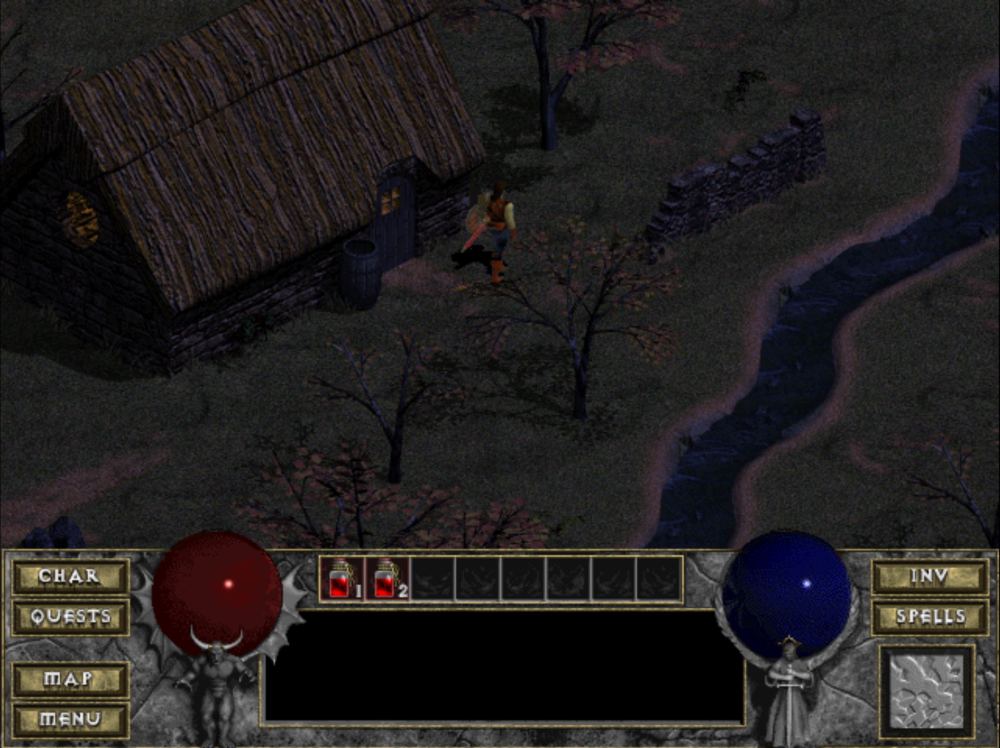

# Diablo Web



This project is a web-based port of the original Diablo game. The goal of this project is to bring the classic experience of Diablo to the browser with a modern tech stack, including Vite and TypeScript.

## Playing Diablo

This project is hosted on [https://johnimril.github.io/diablo_web/](https://johnimril.github.io/diablo_web/) along with `spawn.mpq` from the shareware version (place it in the public folder to run locally). This allows the shareware version to be played anywhere, even on mobile phones. To play the full game, you must use your own `DIABDAT.MPQ` that you can obtain with the original copy of the game from [GoG](url=https://www.gog.com/game/diablo).

## About the Project

This project was initially based on the [DiabloWeb](https://github.com/d07RiV/diabloweb) repository by d07RiV. Due to compatibility issues with Node 22, I decided to fork and fix the original project, which can be found [here](https://github.com/JohnImril/diabloweb-beta). After successfully fixing the build and updating the packages, I chose to take it a step further by rewriting the project using Vite and TypeScript, which led to the creation of this repository.

This project also draws heavily from the work done on [devilution](https://github.com/diasurgical/devilution), which was instrumental in making Diablo 1 playable on web browsers through WebAssembly. The source code to build the WebAssembly modules is available [here](https://github.com/d07RiV/devilution).

I've modified the code to remove all dependencies and exposed the minimal required interface with JavaScript, allowing the game to be compiled into WebAssembly. Significant changes were made to event handling, particularly in the menus, to adapt to the JS model.

## Features

- **Vite Build System**: Fast and efficient development with Vite.
- **TypeScript**: Strongly typed code for better maintainability and error checking.
- **Modernized Codebase**: Updated dependencies and refactored code for better performance and reliability.
- **Compatible with Node 22**: Fixed the issues preventing the project from running on Node 22.

## Getting Started

### Prerequisites

Ensure that you have Node.js (v22 or later) and npm installed on your machine.

### Installation

1. Clone the repository:

    ```bash
    git clone https://github.com/JohnImril/diablo_web.git
    ```

2. Navigate to the project directory:

    ```bash
    cd diablo_web
    ```

3. Install the dependencies:

    ```bash
    npm install
    ```

### Running the Project

Start the development server: `npm run dev`

The application should now be running on `http://localhost:5173/diablo_web/`.

### Building for Production

To build the project for production, run: `npm run build`

The build artifacts will be stored in the `dist/` directory.

## Deploying on Your Own Server

If you want to deploy the project on your own server or hosting environment, consider using the [**diablo_web_simple**](https://github.com/JohnImril/diablo_web_simple) repository. This simplified version makes it easy to host the game without complex configurations.

## Contributing

Contributions are welcome! If you encounter any issues, feel free to open an issue or submit a pull request.

## Acknowledgements

A special thanks to [d07RiV](https://github.com/d07RiV) for the original DiabloWeb project, which served as the foundation for this work. Without their effort, this project wouldn't have been possible. Additionally, thanks to the [devilution](https://github.com/diasurgical/devilution) team for their incredible work in making Diablo 1 accessible on modern platforms.
