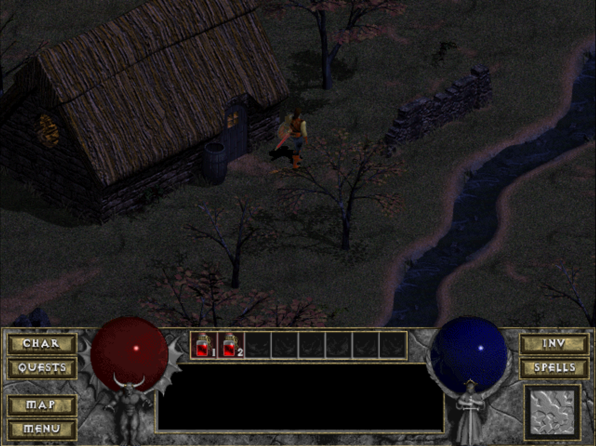

# Diablo Web



**Diablo Web** is a browser-based Diablo / Diablo-like experience built with Vite, React, TypeScript, and
WebAssembly. The project modernizes earlier browser work around DiabloWeb and devilution-based WebAssembly builds,
with a cleaner frontend structure, current Node.js compatibility, browser storage support, and a deployment flow that
targets static hosting.

## Live Demo

The current public build is available here:

[https://johnimril.github.io/diablo_web/](https://johnimril.github.io/diablo_web/)

## Overview

This repository is the main browser client. It loads the game engine through WebAssembly, manages game data in the
browser, renders to canvas, and wraps the runtime in a Vite + React application.

The project started from work around [DiabloWeb](https://github.com/d07RiV/diabloweb) by d07RiV and the
[devilution](https://github.com/diasurgical/devilution) community. An intermediate Node.js 22-compatible fork is
available at [JohnImril/diabloweb-beta](https://github.com/JohnImril/diabloweb-beta). Diablo Web then rebuilt the
client shell around Vite and TypeScript while keeping the WebAssembly engine path central to the runtime.

## Game Data Files

Diablo Web supports two game-data modes:

- `spawn.mpq` for the Diablo shareware data set.
- `DIABDAT.MPQ` for the full game, if you own a legal copy of Diablo.

For local development, place the data file you want to use in `public/` before starting the app. The full retail data
archive is not provided by this project. You are responsible for supplying only files that you are legally allowed to
use.

## Key Features

- Browser-based Diablo / Diablo-like runtime using WebAssembly.
- Vite-powered development and static production builds.
- TypeScript application shell with React UI components.
- Node.js 22-compatible dependency and build setup.
- Support for shareware and full-game MPQ data files.
- Browser-side save and file handling through the storage module.
- Canvas-based rendering with runtime orchestration isolated from UI components.
- Optional network adapters in the client codebase, kept separate from the experimental backend project described below.

## Technical Highlights

### WebAssembly

The engine is loaded through WebAssembly modules under `src/modules/engine/`. A worker bridge coordinates initialization,
progress reporting, MPQ loading, runtime messages, and canvas rendering.

### Vite

Vite is used for the development server, asset handling, WebAssembly integration, and production bundling. The production
build targets static hosting and uses the `/diablo_web/` base path configured in `vite.config.ts`.

### TypeScript

The client is written in TypeScript and organized around a lightweight domain structure:

- `src/app/runtime/` for orchestration.
- `src/modules/<domain>/core/` for pure domain logic.
- `src/modules/<domain>/adapters/` for browser, worker, storage, and network side effects.
- `src/components/` and `src/app/ui/` for React UI.

### Node.js 22 Compatibility

Earlier compatibility issues with modern Node.js versions were resolved during the modernization work. The current
project is intended to run on Node.js 22 or newer.

## Architecture Overview

The main runtime flow is:

1. Start the Vite/React client.
2. Load or import the selected MPQ data file.
3. Initialize the WebAssembly engine through the worker bridge.
4. Mount browser-side storage and save data.
5. Route input, rendering, runtime events, and optional network messages through the app runtime.

Additional notes are available in [ARCHITECTURE.md](./ARCHITECTURE.md).

## Related Project: hellgate-ws

[hellgate-ws](https://github.com/JohnImril/hellgate-ws/tree/main) is a related companion backend project. It is separate
from this client repository and is not required to run Diablo Web locally.

The original browser/WASM Diablo projects did not include a working online multiplayer backend. Only a limited API /
binary protocol surface was available on the client/WASM side. To fill that missing layer, I designed and implemented
**hellgate-ws** from scratch as a compact real-time multiplayer backend foundation.

It is built on **Cloudflare Workers** and **Durable Objects** and provides:

- WebSocket gateway.
- Lobby / game directory.
- Room-based multiplayer sessions.
- Player slot management.
- Message routing.
- Custom binary protocol messaging.
- Turn synchronization.

`hellgate-ws` explores how online sessions, lobby discovery, room lifecycle, player ownership, message routing, and turn
synchronization can be implemented for a Diablo-like browser/WASM game using modern edge infrastructure.

The backend is not production-hardened yet and is maintained separately from this repository. It should be treated as a
working multiplayer backend foundation for experimentation and further hardening, not as finished production multiplayer
support in the main Diablo Web client.

## Getting Started

### Prerequisites

- Node.js 22 or newer.
- npm.
- A supported MPQ data file, if you want to run the game locally.

### Installation

```bash
git clone https://github.com/JohnImril/diablo_web.git
cd diablo_web
npm install
```

Place `spawn.mpq` or `DIABDAT.MPQ` in `public/` if your local checkout does not already contain the data file you want
to use.

## Development

Start the Vite development server:

```bash
npm run dev
```

The app is served with the configured base path:

[http://localhost:5173/diablo_web/](http://localhost:5173/diablo_web/)

Run linting with:

```bash
npm run lint
```

## Production Build

Create a production build:

```bash
npm run build
```

The compiled output is written to `dist/`.

Preview the production build locally:

```bash
npm run preview
```

## Deployment

The main project is configured for static deployment under `/diablo_web/`, matching the GitHub Pages demo path.

For a simpler deployment-oriented variant, see
[diablo_web_simple](https://github.com/JohnImril/diablo_web_simple).

## Roadmap

- Continue improving WebAssembly loading, progress reporting, and runtime error handling.
- Strengthen save import/export flows and browser storage reliability.
- Improve mobile and touch controls.
- Keep Vite, TypeScript, React, and Node.js compatibility current.
- Clarify the boundary between local client networking experiments and any future backend integration.
- Continue exploring online multiplayer through the separate `hellgate-ws` backend while keeping the client/backend
  boundary explicit.

## Project Status

Diablo Web is an active browser-client modernization project. The main focus is keeping the WebAssembly-based Diablo
runtime usable in a modern Vite/TypeScript application while preserving a clean path for local development and static
deployment.

Multiplayer backend work is handled in the separate `hellgate-ws` project. It provides a working compact backend
foundation for online multiplayer experiments, but it is not required to run the main client and should not be presented
as finished production multiplayer support.

## Acknowledgements

- [d07RiV/diabloweb](https://github.com/d07RiV/diabloweb) for the original browser project that inspired this work.
- [diasurgical/devilution](https://github.com/diasurgical/devilution) for the community engine work that made modern
  browser execution possible through WebAssembly.

## Legal Note

Diablo and related names, artwork, audio, and game data belong to their respective owners. This project does not grant
rights to any commercial game data. Use only MPQ files that you are legally permitted to use.

## License

No repository license file is currently included. Add an explicit license before accepting external contributions or
redistributing packaged builds.
