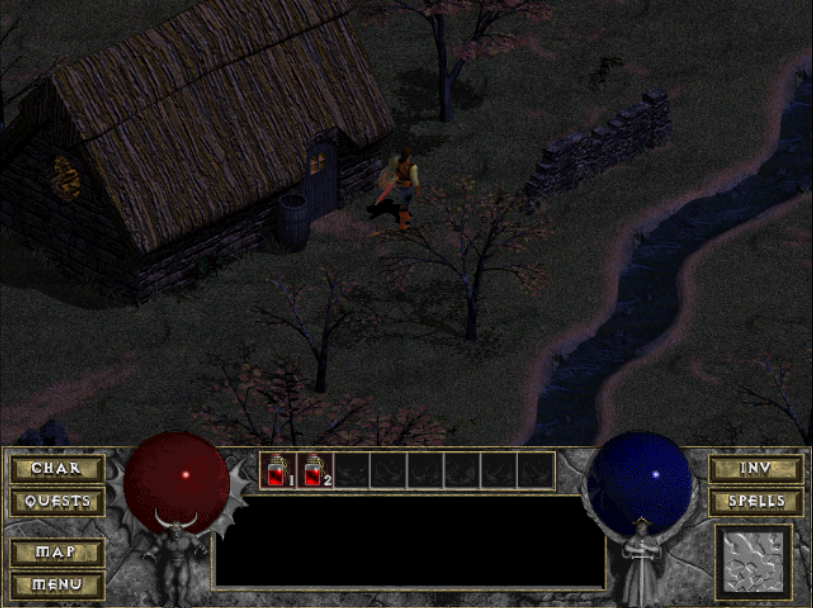

# Diablo Web — The original Diablo, playable in your browser.



**[Play the Live Demo](https://johnimril.github.io/diablo_web/)**

- **Play Free Demo** starts the limited shareware version. No purchase or local MPQ is required.
- **Load Your MPQ** starts the full game with your own `DIABDAT.MPQ` from a legal copy of Diablo.
  You can also drop the file onto the start screen.

A React + TypeScript client built with Vite, integrating an existing WebAssembly version of the Diablo engine.
It handles runtime lifecycle, canvas rendering, browser input, game files, and saves.

## Author

Browser-client modernization by **[Nikita Maksimov](https://github.com/JohnImril)**.
[Portfolio](https://nikitamaksimov.dev).

My work includes the React/TypeScript shell, runtime orchestration and worker integration, browser storage and save
management, and the build and static deployment setup. It builds on earlier browser and WebAssembly work; the
original game, reconstructed engine, and initial WebAssembly port are credited in [Origins and Credits](#origins-and-credits).

## Playing and Saving

Use a mouse and keyboard for the best experience. Touch controls are available, but mobile controls still need
improvement; landscape gives the game more room.

### Game Data

| Mode | Data file | How to play |
| --- | --- | --- |
| Free shareware demo | `spawn.mpq` | Choose **Play Free Demo**; the app downloads the archive on first use. |
| Full game | `DIABDAT.MPQ` | Choose **Load Your MPQ** or drop your own archive onto the start screen. |

The demo contains limited content. Retail game data is not included. Use a legal copy of Diablo to obtain
`DIABDAT.MPQ`; see [Diablo on GOG](https://www.gog.com/game/diablo).

To reduce an MPQ's size, open **Controls, limitations & game files** on the start screen and choose
**Compress an MPQ to reduce its size**.

### Save Import and Export

Game files and saves are stored locally in the current browser/profile through IndexedDB. There is no cloud-save
service. Export saves before clearing browser data or moving to another browser or device.

- **Export:** open **Manage Saves** on the start screen and download the saves you want to keep.
- **Import:** use the upload control in **Manage Saves**, or drop a `.sv` file onto the start screen.
  **Manage Saves** appears when saves are available.
- **Loading errors:** use **Reload and Try Again** when offered to return to the start screen without clearing
  browser data. If reload cannot proceed, keep the page open, download any saves offered, and retry.

Online multiplayer is experimental. It is not finished support for ordinary play; see [Multiplayer](#multiplayer).

## Engineering and Architecture

The browser client separates React UI from runtime orchestration, domain logic, and browser adapters:

- **React + TypeScript + Vite:** UI components call runtime APIs and subscribe to events.
  Vite handles development, WebAssembly assets, and production bundling.
- **WebAssembly and workers:** the engine integration loads the existing WASM builds and bridges initialization,
  MPQ data, progress, rendering, and engine messages between the worker and the browser client.
- **Runtime lifecycle:** the runtime owns game sessions, startup and cancellation, worker cleanup, input handling,
  and UI event delivery.
- **Canvas and input:** browser input becomes typed commands, which are mapped to engine actions;
  the UI bridge connects engine output to canvas rendering and browser controls.
- **Browser storage:** IndexedDB adapters manage game files, save data and metadata, import/export,
  and tracked storage writes. MPQ compression has a separate worker/WASM adapter.

### Source Layout

| Path | Responsibility |
| --- | --- |
| `src/app/runtime/` | Sessions, lifecycle, events, input orchestration, and UI bridge |
| `src/modules/<domain>/core/` | Pure domain logic, types, and mappings |
| `src/modules/<domain>/adapters/` | Engine, worker, DOM, storage, and network side effects |
| `src/components/`, `src/app/ui/`, `src/app/uiHooks/` | React UI and hooks |
| `src/shared/` | Shared helpers and parsers |

The main flow is to prepare browser storage, load the selected game data, initialize the WASM engine through the
worker bridge, then route input, rendering, and runtime events while the session runs.

See [ARCHITECTURE.md](./ARCHITECTURE.md) for module boundaries, entrypoints, and the workflow for adding a feature.

## Getting Started

### Prerequisites

- Node.js 22 (used by the GitHub Actions deployment workflow) and npm.
- A browser with WebAssembly, Web Workers, and IndexedDB support.
- Shareware data or your own retail MPQ to play locally.

### Installation

```bash
git clone https://github.com/JohnImril/diablo_web.git
cd diablo_web
npm install
```

For **Play Free Demo**, ensure `public/spawn.mpq` is available in your checkout. The demo loader requests this
file from the app's static assets. For the full game, select your own `DIABDAT.MPQ` through **Load Your MPQ**;
placing it in `public/` does not automatically select it.

### Development

Start the Vite development server:

```bash
npm run dev
```

Open [http://localhost:5173/diablo_web/](http://localhost:5173/diablo_web/).
If the port is busy, use the URL printed by Vite.

Run the code checks:

```bash
npm run lint
npm test
```

### Production Build

Build the client and preview the result locally:

```bash
npm run build
npm run preview
```

The build runs TypeScript checking before Vite bundling and writes the output to `dist/`.
Open the preview URL printed in the terminal.

## Deployment

The client runs on static hosting; a game backend is not required for the demo or local single-player game.
The base path is `/diablo_web/` in [vite.config.ts](./vite.config.ts), matching the GitHub Pages demo.

The [deployment workflow](./.github/workflows/deploy.yml) installs dependencies with `npm ci`, runs linting,
builds the client, and publishes `dist/` to GitHub Pages. Markdown-only changes are excluded from automatic deployment.
For another hosting path, update the Vite base configuration accordingly.

For a simpler deployment-oriented variant, see
[diablo_web_simple](https://github.com/JohnImril/diablo_web_simple).

## Multiplayer

[hellgate-ws](https://github.com/JohnImril/hellgate-ws/tree/main) is a separate experimental backend project for
online multiplayer work. It is not required to launch Diablo Web. Client networking adapters and backend experiments
should not be read as finished, production-ready multiplayer support.

## Status and Next Steps

The project focuses on modernizing the browser client around the existing Diablo WASM runtime.
Current areas for improvement include:

- Loading feedback and runtime error handling.
- Save import/export and browser storage reliability.
- Mobile and touch controls.
- Build-tool compatibility and the boundary between client networking and backend experiments.

## Origins and Credits

- **Diablo:** the original game by Blizzard North; game data, artwork, audio, and names belong to their respective owners.
- **[devilution](https://github.com/diasurgical/devilution):** reconstruction of the original engine by GalaXyHaXz
  and the devilution community.
- **[DiabloWeb](https://github.com/d07RiV/diabloweb):** d07RiV's earlier browser client.
  Its [engine fork](https://github.com/d07RiV/devilution) contains the earlier WebAssembly build work.
- **[diabloweb-beta](https://github.com/JohnImril/diabloweb-beta):** the intermediate modernization fork
  preceding this Vite/TypeScript client.

Nikita Maksimov's contribution is the modernization and integration of the browser client described above.
The original Diablo engine and earlier WebAssembly port are upstream work.

## License and Game Data Rights

This repository does not currently include a project license file. Licensing for the client, inherited code, and
bundled WebAssembly artifacts still needs clarification; no blanket license is asserted here.
Consult the upstream projects' notices, including
[devilution's LICENSE.md](https://github.com/diasurgical/devilution/blob/master/LICENSE.md).

This project does not grant rights to commercial game data. Supply only MPQ files you are legally permitted to use.
